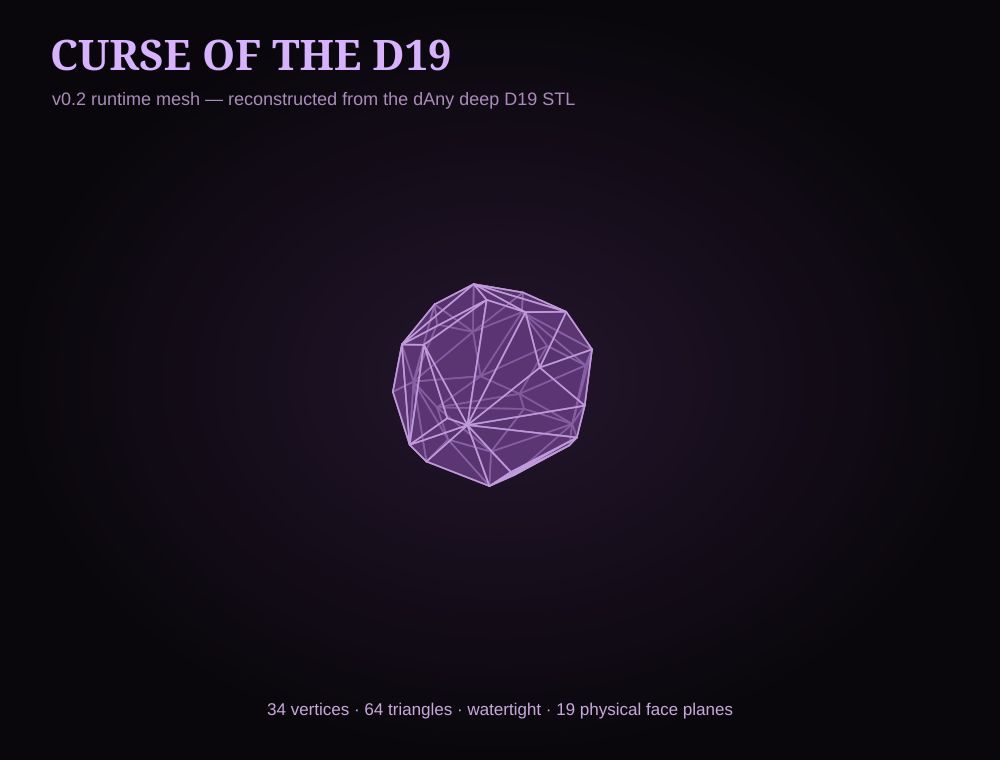

# Curse of the D19

A tiny Foundry VTT v14 module for the truly cursed adventurer: roll a **real d19** with Dice So Nice.

## Actual mesh preview



The v0.2 runtime mesh is reconstructed from the physical outer faces of the deep-engraved D19 from **dAny - parametric Any Number Dice**. It is a lightweight, watertight GLB intended for Dice So Nice physics/rendering.

## Status

**v0.2.1 display diagnostic build**

The v0.2.0 test confirmed that Foundry evaluates `/r 1d19`, but Dice So Nice silently skipped rendering because `d19` is not one of its built-in physical shapes.

v0.2.1 keeps the real D19 GLB but explicitly maps the visual preset onto Dice So Nice's supported `d20` physics host. This is a diagnostic step only: it tells us whether Dice So Nice can instantiate and display the custom GLB at all. It is not the final result-orientation/physics solution.

## Requirements

- Foundry Virtual Tabletop v14
- Dice So Nice 6.2.x or another v14-compatible release

## Install for testing

Place the module folder at:

```text
Data/modules/curse-of-the-d19/
```

Restart Foundry, enable **Dice So Nice** and **Curse of the D19**, then enter:

```text
/r 1d19
```

### What to check

1. `/r 1d19` still returns a numerical result from 1 through 19.
2. A 3D die appears at all.
3. Whether the custom D19 mesh is visible.
4. If the die appears, ignore result-face accuracy for this diagnostic build.
5. If nothing appears, copy any console output containing `Curse of the D19` or `Dice So Nice`.

The console should contain:

```text
Curse of the D19 | Registered d19 model using DSN d20 physics host for display testing.
```

## Design rule

No fake d20 as the final die. No remapped d24. 💀

## Model source and licensing

The D19 geometry is adapted from **dAny - parametric Any Number Dice (d19 d7 d13 d21 d20 d9 d100)** by **dunaevai135**:

https://www.printables.com/model/769247-dany-parametric-any-number-dice-d19-d7-d13-d21-d20

The adapted model remains under **CC BY-SA**. See [ATTRIBUTION.md](ATTRIBUTION.md) and [models/README.md](models/README.md).

The Foundry module code is licensed separately under the MIT License.
